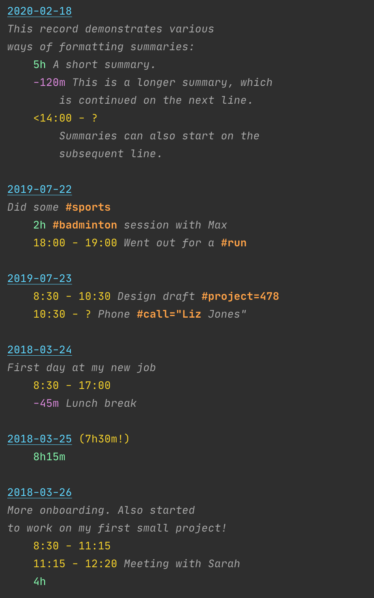

# klog.vim
Syntax hightlighting for [klog](https://github.com/jotaen/klog) in `vim`.



## Installation
Just copy these files to your `~/.vim` folder:
```sh
mkdir -p ~/.vim/ftdetect && cp ftdetect/klog.vim "$_"
mkdir -p ~/.vim/syntax && cp syntax/klog.vim "$_"
```

### For Neovim users
Same instructions: simply make sure this repo ends up on your `runtimepath`.  
```sh
git clone https://github.com/73/vim-klog.git anywhere/you/want
nvim -u NONE +'set runtimepath+=anywhere/you/want' +':syntax on' 2025.klg
```
(these instructions work for Vim as well, just replace `nvim` with `vim`)

If you use package managers:
```lua
-- with lazy.nvim (https://github.com/folke/lazy.nvim):
require('lazy').setup({ '73/vim-klog' })

-- with Neovim's new built-in package manager (not into stable release yet):
vim.pack.add { 'https://github.com/73/vim-klog' }
```
